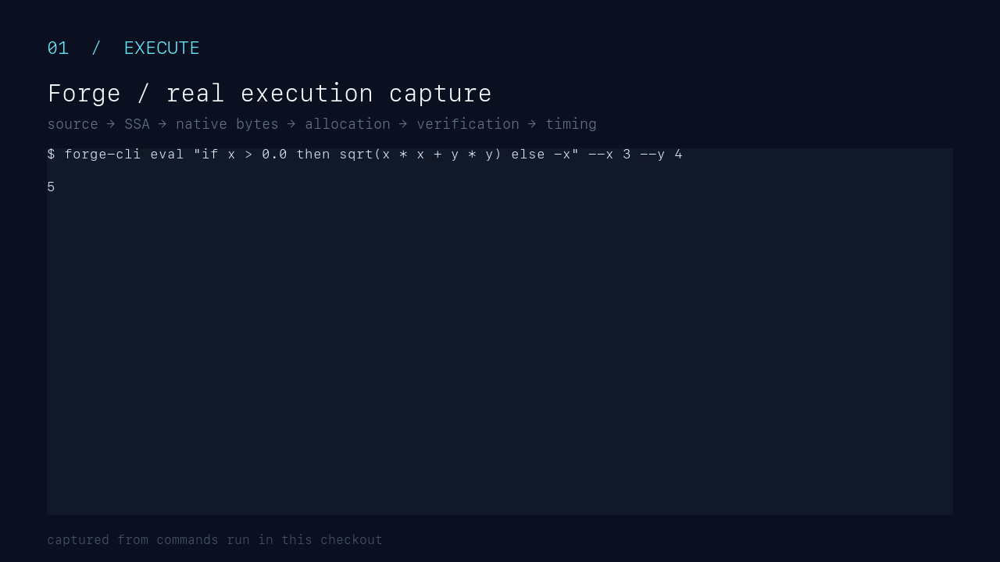

# forge

[](https://github.com/sanskarpan/forge/actions/workflows/ci.yml)
[](https://github.com/sanskarpan/forge/actions/workflows/ci-containers.yml)
[](https://sanskarpan.github.io/forge/)
[](LICENSE)

`forge` is a small, auditable JIT compiler for typed mathematical
expressions. It includes a handwritten frontend, typed SSA IR, reference
interpreter, semantics-preserving optimizer, linear-scan register allocator,
W^X executable memory, handwritten x86-64 emission, AArch64 emission, SIMD
array evaluation, portable WebAssembly artifacts, and a compiler workbench.



The project is educational in scope but production-minded in engineering:
every unsafe boundary is documented, generated code is differentially checked
against the interpreter, encoders have disassembly round trips, and platform
behavior is validated in native and containerized CI. It is not intended to be
used as an unreviewed sandbox for hostile code; see [SECURITY.md](SECURITY.md).

## What it demonstrates

| Layer | Capability |
| --- | --- |
| Frontend | Spans, diagnostics, typed expressions, `let`, conditionals, intrinsic calls |
| IR | SSA values, φ nodes, dominance, structural verification, textual printing |
| Optimizer | Folding, GVN/CSE, DCE, reassociation, strength reduction, FMA handling |
| Native code | Handwritten x86-64 and AArch64 encoders, ABI-aware calls, spills, W^X memory |
| Arrays | Packed f64 evaluation, tails, reductions, broadcasts, offsets, nested shapes |
| Portable artifacts | Typed WASM, decoded stack instructions, lifetimes, AST/IR/CFG metadata |
| Tooling | `eval`, `compile`, `asm`, `ir`, `cfg`, `regalloc`, `bench`, `verify`, `repl` |
| Workbench | Live editor, diagnostics, AST/IR/CFG, allocation, bytes, benchmarks, targets |

## Quick start

```sh
cargo test --workspace --offline --locked
cargo clippy --workspace --all-targets --offline --locked -- -D warnings
cargo fmt --all -- --check

cargo run -p forge-cli -- eval 'x * x + 1' --x 3
cargo run -p forge-cli -- asm 'x * x + 1'
cargo run -p forge-cli -- ir 'sqrt(x * x + y * y)'
cargo run -p forge-cli -- cfg 'if x > 0.0 then x else -x' --dot
```

To run the workbench locally:

```sh
npm ci --prefix workbench
npm test --prefix workbench
npm run build --prefix workbench
npm run dev --prefix workbench
```

The workbench expects a release `forge-wasm-api` web bundle exposed as
`window.forgeWasm`. The browser executes WASM artifacts; x86-64 and AArch64
bytes are inspection artifacts and are never executed in the browser.

## Architecture

```text
source
  → lex / parse / resolve / type-check
  → typed SSA IR
  → verify
  → optimize (with verification after every pass)
  → select machine instructions
  → allocate registers and spill slots
  → verify allocation
  → emit handwritten machine code
  → W^X executable memory
```

The interpreter is the semantic oracle. Native differential tests compare
result bits, including NaNs, infinities, signed zero, subnormals, integer
overflow, and guarded operations. Portable and unsupported paths fail closed to
the verified interpreter rather than guessing at an ABI.

## Repository map

```text
crates/forge-syntax   lexer, parser, resolver, diagnostics, type checker
crates/forge-ir       typed SSA IR, lowering, interpreter, verifier
crates/forge-opt      optimization passes and differential property tests
crates/forge-x64      handwritten x86-64 instruction selection and encoding
crates/forge-aarch64  AArch64 encoding, scalar emission, ABI support
crates/forge-regalloc liveness, linear scan, spills, allocation verification
crates/forge-emit     physical x86-64 emission and layout
crates/forge-mem      W^X executable memory and code cache
crates/forge-runtime  public compile/evaluate/tiering APIs
crates/forge-simd     packed array plans and feature-safe evaluation
crates/forge-wasm     portable WASM byte emission
crates/forge-wasm-api wasm-bindgen/browser artifact API
crates/forge-cli      command-line inspection and evaluation tools
workbench/            React/Vite compiler observatory
docs/                 mdBook documentation and implementation guides
```

## Supported boundaries

The current implementation status is maintained in
[`CHECKLIST.md`](CHECKLIST.md). Registered native external functions require
an explicit name, address, scalar parameter types, and scalar result type. The
runtime validates that contract and marshals supported f64/i64/bool signatures
for System V x86-64, Win64, and AAPCS64. Raw function addresses are rejected
from WASM and other portable paths.

Array mode supports canonical indexed columns, constant and loop-invariant
typed offsets, scalar broadcasts, packed libm adapters, reductions, tails, and
checked nested row-major shapes. Arbitrary per-row gathers and arbitrary
memory addressing remain outside the language contract. Unsupported native
operations use the interpreter fallback with an explicit diagnostic.

## Documentation

The [Forge documentation site](https://sanskarpan.github.io/forge/) is built
from `docs/` with mdBook on every documentation change and deployed from
`main`. Useful entry points include:

- [Architecture](docs/ARCHITECTURE.md)
- [Testing and verification](docs/TESTING.md)
- [Platform and W^X notes](docs/PLATFORMS.md)
- [Encoding guide](docs/ENCODING.md)
- [Register allocation guide](docs/REGALLOC.md)
- [Optimization guide](docs/OPTIMIZATION.md)
- [Contributing](CONTRIBUTING.md)
- [Security policy](SECURITY.md)
- [Changelog](CHANGELOG.md)

## Quality gates

The required CI matrix covers macOS build/codesign, native Windows, Linux
x86-64 containers, emulated Linux ARM64, WASM packaging, Workbench builds,
Valgrind executable-memory checks, Clippy, and rustfmt. The same commands are
available through `make`, including `make container-test-arm64` on an Apple
Silicon host with Docker or Podman.

## License

MIT. See [LICENSE](LICENSE).
